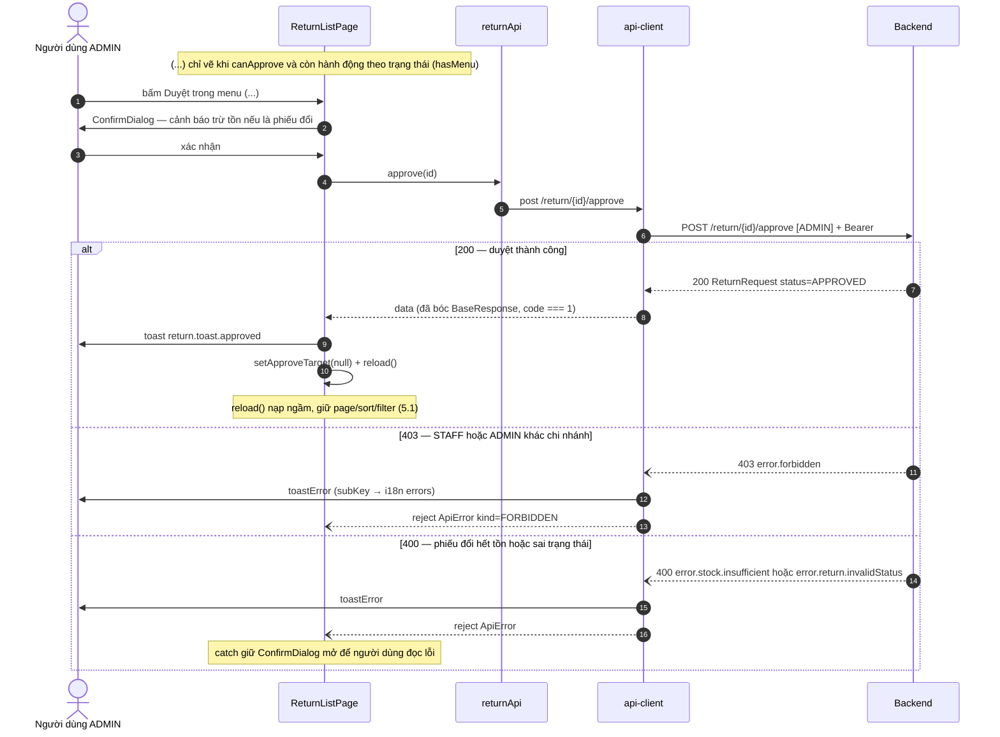

# Sequence diagram từ trace code FE

Nguyên tắc: **vẽ từ code thật, không vẽ từ trí nhớ.** Diagram phía FE trả lời "người dùng làm gì →
FE gọi gì → backend trả gì → FE hiện gì"; mỗi message trỏ được về một dòng code (`file:dòng`) hoặc
một dòng **đã đo thật** trong `docs/backend/<domain>.md`. Diagram sai còn hại hơn không có — reviewer
sẽ tin nó thay vì đọc code.

Ranh giới với backend: **Backend là MỘT participant hộp đen.** Không vẽ Resource/ServiceImpl/DB —
đó là việc của skill `sequence-diagram` bên `35.1.eloria-backend`. Cần diagram end-to-end ⇒ vẽ nửa
FE ở đây, nửa backend bằng skill bên đó, hai doc **link nhau, không chép** (tránh 2 bản lệch).

## Vị trí & định dạng

- **Nhúng tại chỗ** là mặc định: `docs/srs/` (đúng mục FE-FR), `docs/backend/<domain>.md`,
  `docs/backend-request-*.md`, `docs/handoff/`. Tách riêng `docs/diagrams/seq-<flow>.md` chỉ khi
  ≥ 2 doc tham chiếu; khi đó các doc kia link tới, không copy.
- Định dạng: khối ```` ```mermaid ```` + `sequenceDiagram` (GitHub render được). **Trên** diagram:
  đoạn dẫn 2–4 dòng — luồng gì · entry point (route + hành động, vd "màn `/returns`, bấm *Duyệt* ở
  menu `(...)`") · tiền điều kiện (role tối thiểu, trạng thái bản ghi, ca đang mở…).
- **Dưới** diagram: bảng **chú thích bước → code** (`bước N · nơi · file:dòng`) — đây là bằng chứng
  diagram đúng. Bước là hành vi backend ⇒ cột "nơi" ghi `docs/backend/<domain>.md § …` + ngày đo.

## Bước 1 — Trace luồng

Entry point = màn + hành động người dùng (mount màn · submit form · bấm nút · đổi filter). Đọc theo
chuỗi dưới, **ghi nháp danh sách bước có `file:dòng` TRƯỚC khi viết Mermaid**:

| Lớp | Đọc gì | Lấy ra |
|---|---|---|
| Route | `src/Router.tsx` · `src/components/route-guards.tsx` · `src/config/menu.ts` | `ProtectedRoute` / `RoleRoute` (`minRole`, `redirectTo`) · menu ẩn theo role |
| Màn / dialog | `src/pages/<màn>/*.tsx` + `components/` | gate nút (`hasRole`, `<Can>`, điều kiện theo trạng thái kiểu `hasMenu = canApprove && …`) · `ConfirmDialog` · submit · key `toastSuccess` · `reload()` / `afterMutation` · `AbortSignal` |
| Hook | `src/hooks/use-table-state.ts` · `use-paged-search.ts` · `use-sku-options.ts` · `use-cart.ts` | page/sort/filter · `setPage(1)` khi đổi truy vấn · so `data.length` với `total` |
| Service | `src/api/<domain>.ts` | `method path` + `[ROLE]` trong JSDoc + quirks đã ghi (vd `lines: null`) |
| api-client | `src/lib/api-client.ts` | request interceptor gắn Bearer + `Accept-Language` (~dòng 79) · response: 401 ⇒ `runRefreshOnce()` ⇒ retry 1 lần / hỏng ⇒ `notifySessionExpired()` (~221–245) · `toApiError` + `toastError` (~256) · `unwrap` bóc `data` khi `code === 1` (~267–283) |
| Lỗi & phiên | `src/lib/api-error.ts` (`resolveErrorMessage`: subKey → i18n `errors` → `message` backend → fallback) · `src/lib/token-store.ts` · `src/contexts/AuthProvider.tsx` (bootstrap `meSilent` · `login` chặn CUSTOMER · `logout` nuốt 401) | chỉ vẽ khi luồng là auth/lỗi |
| Backend | `docs/backend/<domain>.md` + `README.md` | HTTP status · subKey · **thứ tự guard đã đo thật**. Doc chưa đo ⇒ ghi "chưa đo", **không bịa** |

Luồng lớn có thể fan-out Explore để liệt kê file, nhưng gate quyền + nhánh lỗi + thứ tự gọi API
phải **tự đọc**.

## Bước 2 — Chọn mức chi tiết (quan trọng nhất)

Chỉ vẽ bước **mang nghĩa nghiệp vụ hoặc invariant kỹ thuật của FE**:

- **CÓ**: guard route/RBAC và hệ quả (redirect `/login` · `/403` · `/pos`) · điều kiện ẩn/hiện nút
  theo quyền + trạng thái bản ghi · xác nhận người dùng (`ConfirmDialog`) · validate chặn submit khi
  nó *là* nghiệp vụ (vượt tồn, SĐT sai định dạng) · **từng** lời gọi API (`method path`) và thứ tự ·
  Bearer / cookie refresh / refresh single-flight khi luồng là auth · nhánh lỗi: HTTP status + subKey
  ⇒ FE hiện gì (toast · inline · giữ dialog) · cập nhật state đổi UI (đóng dialog · nạp lại **giữ
  ngữ cảnh** 5.1 · `setPage(1)` khi đổi truy vấn · xoá giỏ) · huỷ request khi unmount/đổi filter
  nếu đó là điểm mấu chốt.
- **KHÔNG**: render/JSX · mapper DTO · lookup i18n từng chuỗi · Tailwind · `console` · zod trivial
  ("bắt buộc nhập") · spinner/loading (trừ khi luồng nói về loading) · `useMemo`/`useCallback`.

Diagram > ~25 message ⇒ **tách 2 hình** (happy path riêng · nhánh lỗi/đối soát riêng), không nhồi.

## Bước 3 — Viết Mermaid theo convention

- `autonumber` **bắt buộc** — doc tham chiếu "bước N" theo số này, bảng chú thích map theo số này.
- Participant cố định, tên = export thật của component/service, alias ngắn; **`BE` là hộp đen duy nhất**:

  ```mermaid
  sequenceDiagram
    autonumber
    actor U as Người dùng ADMIN
    participant P as ReturnListPage
    participant A as returnApi
    participant C as api-client
    participant BE as Backend
  ```

  Luồng auth thêm `participant TS as token-store` · `participant AP as AuthProvider`; dialog thêm
  `participant D as ReturnRefundDialog`; giỏ hàng thêm `participant CT as CartProvider`. **Không**
  thêm participant cho hook nhỏ (`useTableState`) — ghi bằng `Note`.
- Message tới `BE` ghi `method path` **và role tối thiểu**: `C->>BE: POST /return/{id}/approve [ADMIN]`.
  Response ghi status + nội dung có nghĩa: `BE-->>C: 200 ReturnRequest status=APPROVED` · lỗi
  `BE--)C: 400 error.stock.insufficient`.
- Nhánh: `alt`/`else` cho phân nhánh loại trừ · `opt` cho bước có điều kiện · `break` cho nhánh lỗi
  kết thúc luồng. **Lỗi luôn vẽ về api-client rồi từ đó ra toast/màn** — `toApiError` (FE) và
  `ExceptionTranslator` (backend) dịch tập trung, không vẽ chúng thành participant riêng.
- Invariant ghi `Note over`: `Note over C: 401 ⇒ refresh single-flight, retry đúng 1 lần` ·
  `Note over P: reload() giữ page/sort/filter (5.1)` · `Note over TS: token chỉ in-memory (mục 2)`.
- **Bẫy cú pháp Mermaid**: message/Note **không chứa `;`**, `#`, `%%`; dấu `:` thứ hai trong message
  thay bằng `=` hoặc `—`; không xuống dòng trong message (`<br/>` nếu buộc phải); alias có khoảng
  trắng/tiếng Việt viết thẳng sau `as`, **tránh ngoặc đơn trong alias**; `activate`/`deactivate`
  phải cân cặp; `{id}` và `[ADMIN]` render được nhưng tránh `{{`.

## Bước 4 — Verify

1. **Đối chiếu ngược**: đi từng message về code — điền bảng `bước · nơi · file:dòng`. Không điền
   được ⇒ xoá message hoặc quay lại đọc code.
2. **Thứ tự guard đúng thứ tự thật**: FE là *route guard → gate nút → validate form → gọi API*;
   backend theo thứ tự **đã đo** trong `docs/backend` (vd `invalidStatus` chạy trước
   `stockAlreadyReceived` ở `receive-stock`). Vẽ sai thứ tự = sai nghiệp vụ (subKey người dùng nhận
   sẽ khác).
3. **Số dòng là số dòng hiện tại**: grep lại ngay trước khi nộp
   (`grep -n "returnApi.approve" src/pages/returns/ReturnListPage.tsx`); ghi thêm tên hàm/khối để
   reviewer vẫn tìm được khi số lệch.
4. **Render**: publish nhanh file .md chứa diagram bằng công cụ Artifact (render Mermaid native) hoặc
   dán vào mermaid.live; soát lại từng bẫy ở Bước 3. Diagram lỗi cú pháp trên GitHub hiện nguyên
   text ⇒ coi như chưa giao.

## Bước 5 — Gắn vào doc

Chèn đoạn dẫn + diagram + bảng chú thích vào doc đích. Doc đích là SRS ⇒ gắn đúng mục FE-FR (skill
`srs`). Trong lúc trace phát hiện **code lệch `docs/backend` / mockup / PLAN** ⇒ **báo user**, không
âm thầm vẽ theo bên nào; lỗi thuộc backend ⇒ đề xuất BE# (skill `request-backend`).

## Ví dụ mẫu — Duyệt phiếu trả (`/returns`; số dòng đo 2026-09-14, grep lại trước khi tái dùng)

> Luồng: ADMIN duyệt một phiếu `PENDING_APPROVAL` từ menu `(...)` của bảng. Entry: `ReturnListPage`
> → `ConfirmDialog` → `POST /return/{id}/approve`. Tiền điều kiện: role ≥ ADMIN (STAFF không thấy
> menu), phiếu đang chờ duyệt; phiếu **đổi** sẽ trừ tồn SKU giao mới ngay lúc duyệt.



| Bước | Nơi | file:dòng |
|---|---|---|
| Note gate | `hasMenu = canApprove && (pending \|\| canSettle \|\| canReceive)` | `src/pages/returns/ReturnListPage.tsx:336` |
| 1 | `onSelect={() => setApproveTarget(request)}` | `ReturnListPage.tsx:368` |
| 2–3 | `<ConfirmDialog … onConfirm={handleApprove}>` | `ReturnListPage.tsx:659–670` |
| 4 | `handleApprove` → `returnApi.approve(approveTarget.id)` | `ReturnListPage.tsx:499–502` |
| 5 | `returnApi.approve` | `src/api/return.ts:61` |
| 6 | request interceptor gắn Bearer | `src/lib/api-client.ts:79` |
| 7 · 11 · 14 | hành vi backend đo thật | `docs/backend/doi-tra.md` § Vòng đời · § RBAC & data-scope · § Tồn kho; 400 cho `insufficient`: `docs/backend/don-hang.md` |
| 8 | `unwrap` bóc `data`, `code === 1` | `src/lib/api-client.ts:267–283` |
| 9–10 | `toastSuccess` + `setApproveTarget(null)` + `reload()` | `ReturnListPage.tsx:503–505` · `reload` `:497` |
| 12–13 · 15–16 | `toastError(apiError)` + `Promise.reject` trong response interceptor · `catch` giữ dialog | `src/lib/api-client.ts:256–259` · `ReturnListPage.tsx:506–509` |
